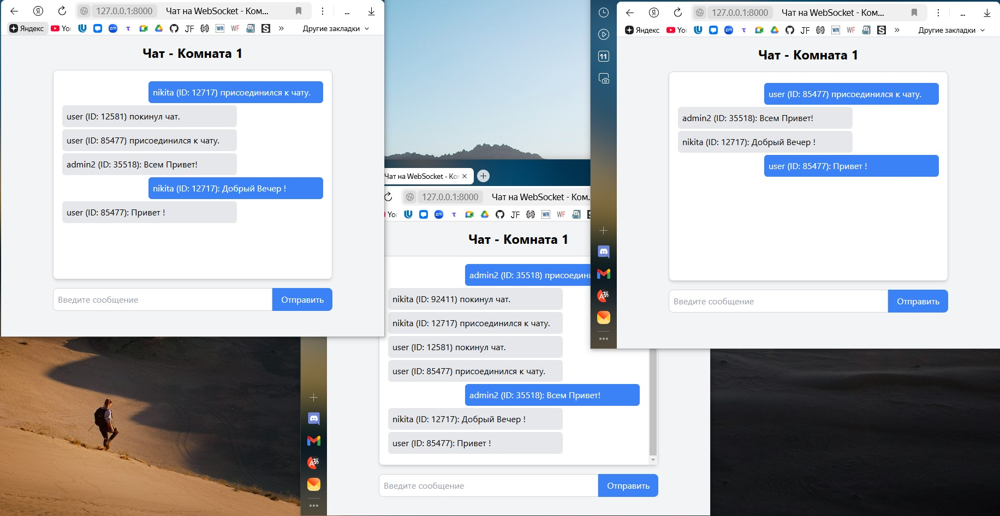

<h1 align="center">FastAPI + WebSocket</h1>
Этот проект представляет собой чат с комнатами, которое позволяет пользователям присоединятся к комнате и вести диалог. Приложение использует FastAPI + WebSocket. 

<h2 align="center">Установка</h2>

1. **Клонируйте репозиторий:**
    ```bash
    git clone https://github.com/NikitaTichonow/fast-api-chat.git

2. **Перейдите в папку проекта:**
    ```bash
    cd fast-api-chat

3. **Установите необходимые зависимости:**
     ```bash
    python -m venv venv
    venv\Scripts\activate    
    pip install -r requirements.txt
   

6. **Запустите сервер разработки:**
    ```bash
    uvicorn main:app --reload 
    
7. **Доступ к приложению:**
    ```
    После завершения всех вышеуказанных шагов, приложение будет доступно по адресу http://127.0.0.1:8000/

<p align="center">
  
</p>
